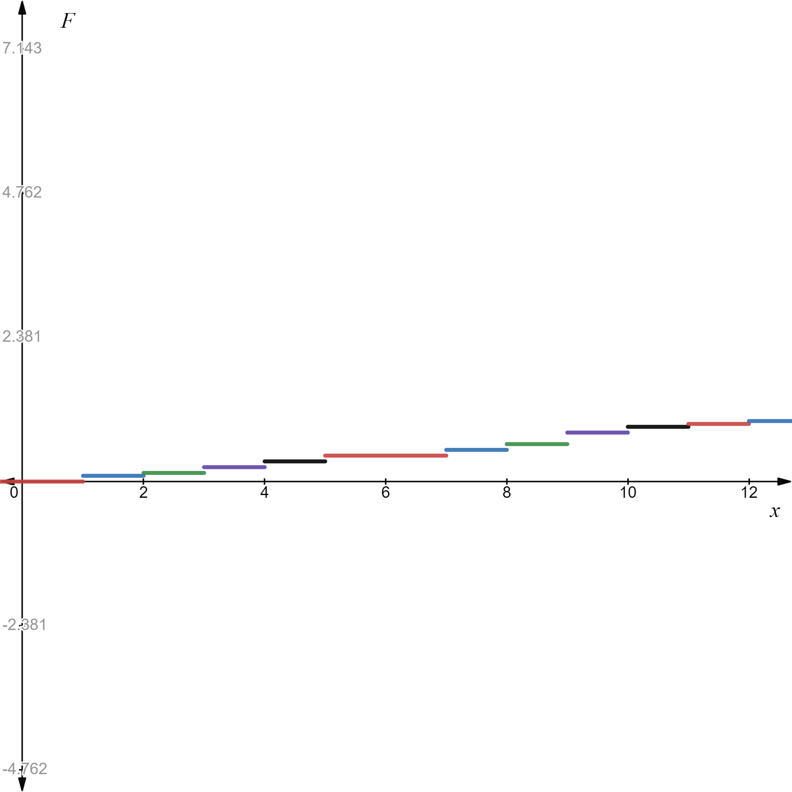
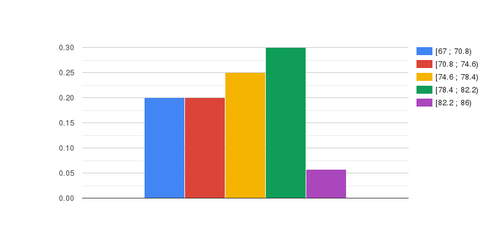

## Месяца.
___
1a) Построим полигон относительных частот для месяцев рождения:

| $x_i$ | 1 | 2 | 3 | 4 | 5 | 7 | 8 | 9 | 10 | 11 | 12 |
|:------|:--|:--|:--|:--|:--|:--|:--|:--|:--|:--|:--|
|$\omega_i$|$\frac{2}{21}$|$\frac{1}{21}$|$\frac{2}{21}$|$\frac{2}{21}$|$\frac{2}{21}$|$\frac{2}{21}$|$\frac{2}{21}$|$\frac{4}{21}$|$\frac{2}{21}$|$\frac{1}{21}$|$\frac{1}{21}$|

1б) $\bar{x_В}=\frac{1}{n}\sum_{i=1}^nx_i=\frac{137}{21}=6,52$

1в) $D_В=\frac{1}{n}\sum_{i=1}^n(x_i-\bar{x_в})^2=10,82$

1г) $\sigma_в=\sqrt{D_В}=3,29$

1д) $V_В=\frac{\sigma_в}{\bar{x_В}}\cdot100\%=50,42\%$

2a)

$F(x)=\begin{cases}
        0, &\quad x<1\\
        \frac{2}{21}, &\quad 1 \leqslant x<2\\
        \frac{4}{21}, &\quad 2\leqslant x<3\\
        \frac{5}{21}, &\quad 3\leqslant x<4\\
        \frac{7}{21}, &\quad 4\leqslant x<5\\
        \frac{9}{21}, &\quad 5\leqslant x<7\\
        \frac{11}{21}, &\quad 7\leqslant x<8\\
        \frac{13}{21}, &\quad 8\leqslant x<9\\
        \frac{17}{21}, &\quad 9\leqslant x<10\\
        \frac{19}{21}, &\quad 10\leqslant x<11\\
        \frac{20}{21}, &\quad 11\leqslant x<12\\
        1, &\quad x\geqslant12\\
     \end{cases}$
___
## Руки.
___
1а) Построим гистограмму.

$n_{bin}=1+\lfloor\log_2n\rfloor=1+4=5$

Разделим отрезок значений на 5 интервалов и получим:
- [67 ; 70.8)
- [70.8 ; 74.6)
- [74.6 ; 78.4)
- [78.4 ; 82.2)
- [82.2 ; 86)

 

1б) $\bar{x_В}=\sum_{i=1}^nx_i\omega_i=75,74$

1в) $D_В=\sum_{i=1}^n(x_i-\bar{x_В})^2\omega_i=21,08$

1г) $\sigma_в=\sqrt{D_В}=4,59$

1д) $V_В=\frac{\sigma_в}{\bar{x_В}}\cdot100\%=6,06\%$